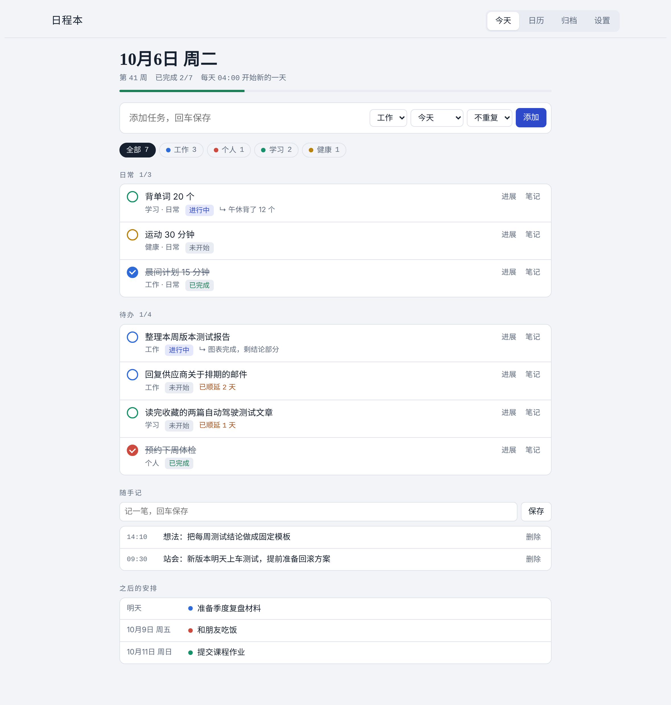
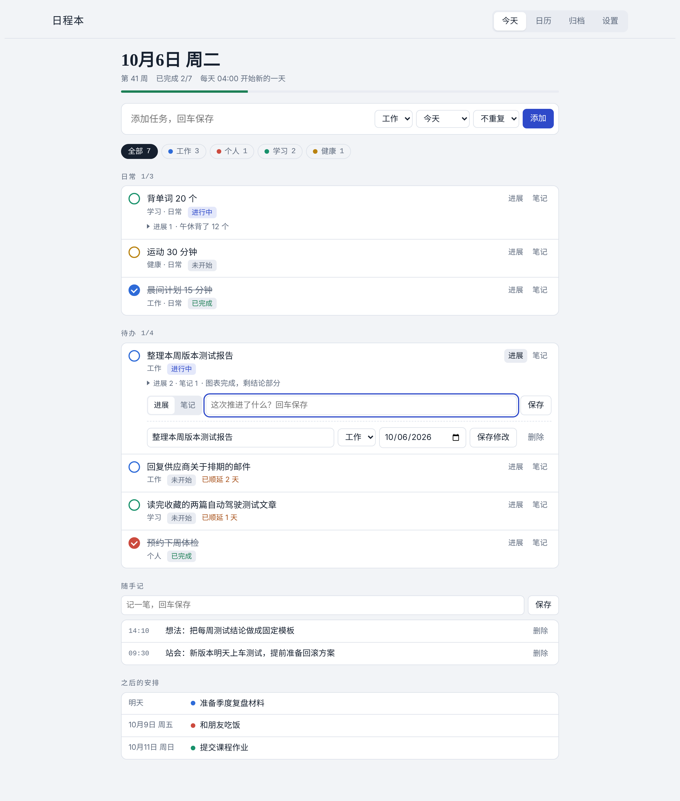
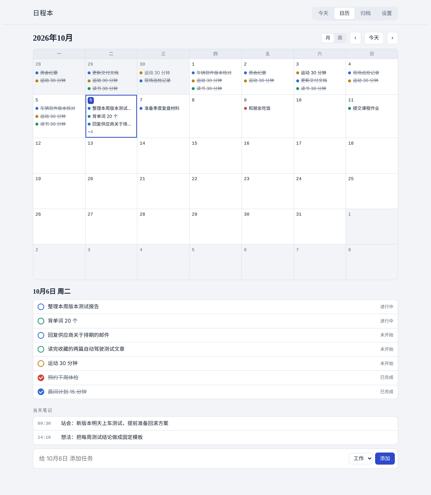
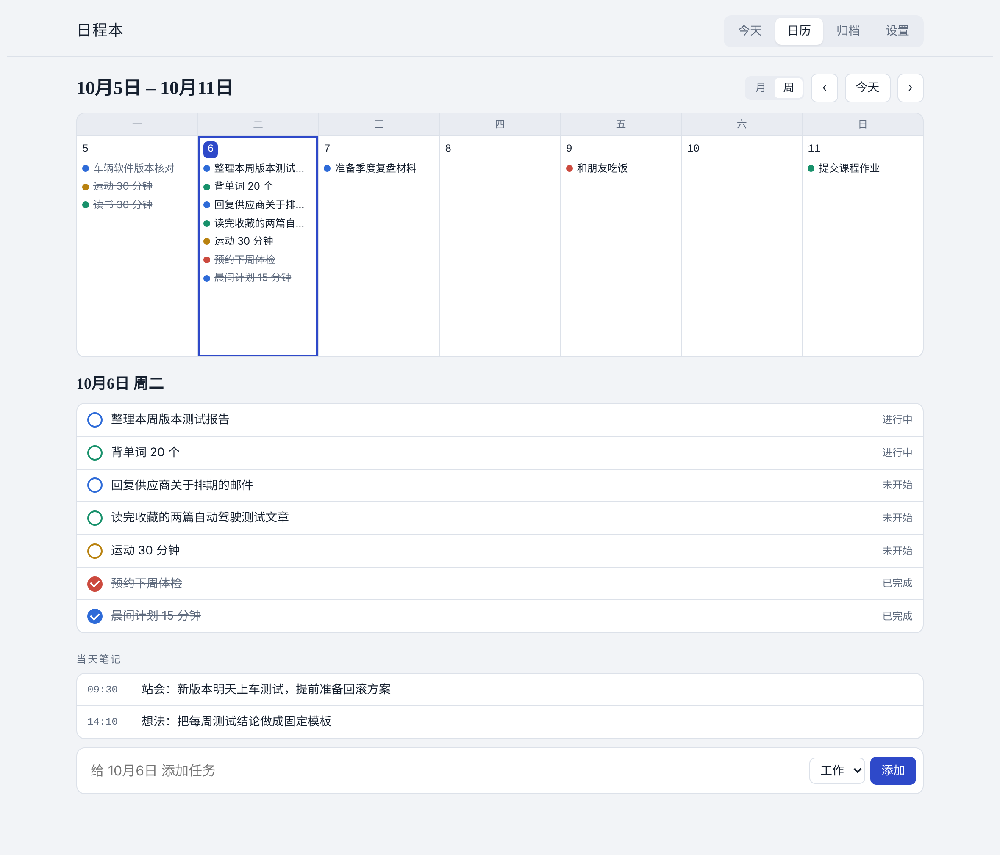
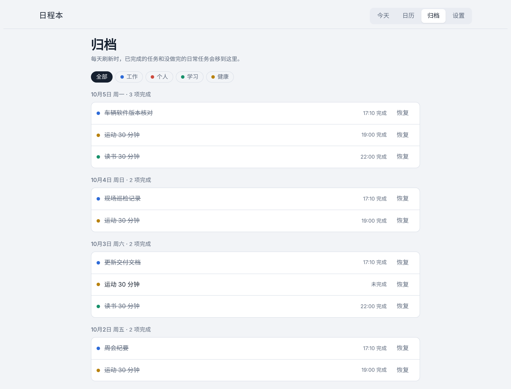
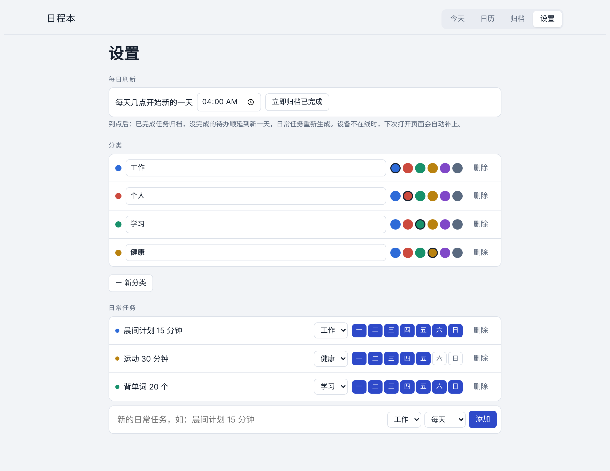
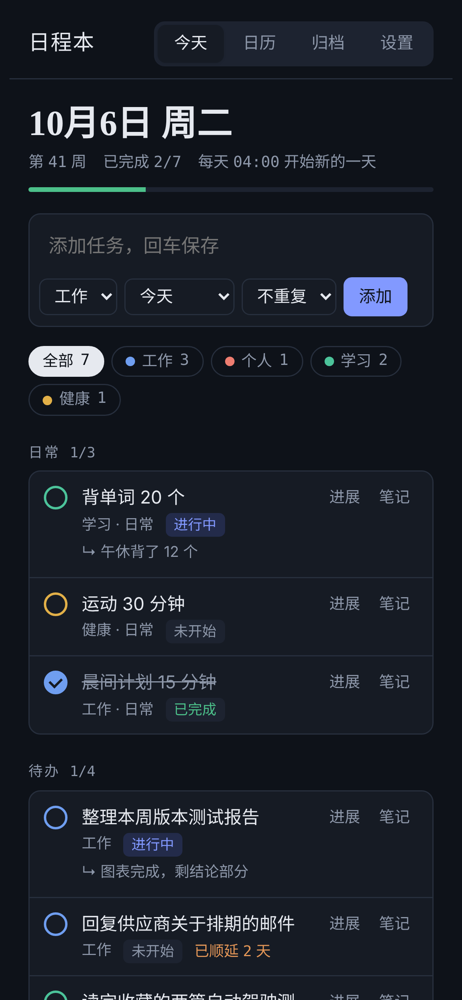
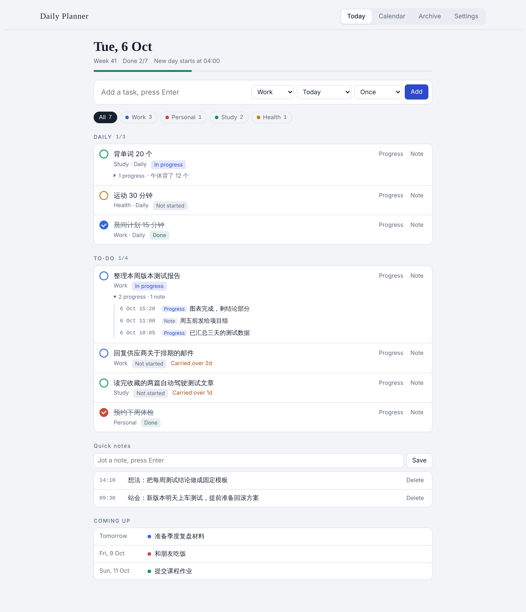
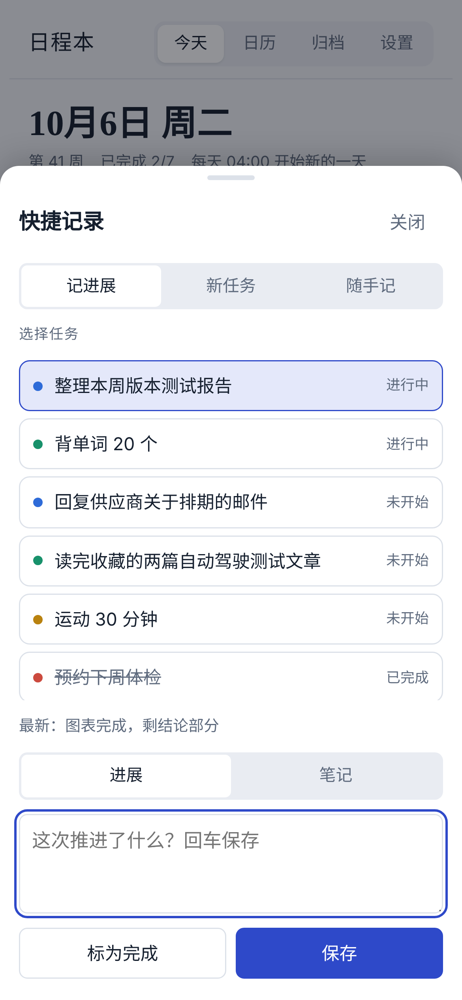

# 日程本 Daily Planner

一个轻量的个人日程网页：在手机和电脑浏览器里都能打开，方便添加每日任务、一键记录进展和笔记，并且每天定时自动整理。



## 功能

- **今天**：输入框回车即可添加任务，可选分类、日期（今天 / 明天 / 指定日期）和重复（每天 / 工作日）
- **一键进展、一键笔记**：每条任务旁都有「进展」「笔记」按钮，输入后回车保存
- **折叠的进展记录**：任务下方直接显示「进展 2 · 笔记 1 · 最新一条」，点一下展开完整时间线，不用进入编辑
- **手机快捷记录**：手机屏幕右下角有一个悬浮的「＋」按钮，点开底部面板就能选任务记进展或笔记、一键标为完成、新建任务、写随手记；任务上的「进展」「笔记」按钮在手机上也会直接打开这个面板
- **状态切换**：点状态标签，在「未开始 → 进行中 → 已完成」之间切换
- **随手记**：不属于任何任务的当日笔记
- **每日自动刷新**（时间可设置，默认 04:00）
  - 已完成的任务自动归档
  - 没做完的待办顺延到新的一天，并标注「已顺延 N 天」
  - 日常任务按重复规则重新生成，前一天没完成的日常任务记为「未完成」后归档
  - 设备离线也不影响：下次打开页面时自动补做
- **日历**：月视图 / 周视图，按分类颜色显示；点某一天可以查看当天的任务和笔记，也能直接给那天添加任务
- **归档**：按日期回顾已完成的任务，误归档的可以一键恢复
- **设置**：刷新时间、分类名称和颜色、日常任务及重复的星期
- **中英双语**：在「设置 → 语言」切换中文 / English，选择会跨设备同步
- 自动适配浅色 / 深色模式和手机屏幕

## 截图

| 任务详情：进展与笔记 | 日历：月视图 |
|---|---|
|  |  |

| 日历：周视图 | 归档 |
|---|---|
|  |  |

| 设置 | 手机 · 深色模式 |
|---|---|
|  |  |

| English | 手机 · 快捷记录 |
|---|---|
|  |  |

> 截图中的任务均为演示数据。

## 文件结构

```
index.html              应用本体（发布到 claude.ai 的 Artifact 页面）
demo.html               本地演示版：双击即可在浏览器打开，使用内存模拟数据
demo/mock-claude.js     模拟 claude.ai 的 db 接口，供 demo.html 使用
tools/build_demo.py     由 index.html 生成 demo.html
screenshots/            README 截图
```

## 运行方式

**正式使用**：`index.html` 作为 [claude.ai](https://claude.ai) 的 Artifact 发布，使用 Artifact 自带的云端数据库（`db` 能力）。只要登录 claude.ai，任何设备打开同一链接，数据都会实时同步。访问规则设置为仅所有者可读写。

**本地预览**：直接用浏览器打开 `demo.html`。演示数据保存在内存中，刷新页面即恢复原样。修改 `index.html` 后运行：

```bash
python tools/build_demo.py
```

## 数据结构

| 集合 | 内容 |
|---|---|
| `tasks/{id}` | `title` `cat` `kind`(once/daily) `routineId` `date` `originDate` `status`(todo/doing/done) `progress[]` `notes[]` `createdAt` `doneAt` `archived` `missed` |
| `routines/{id}` | 日常任务模板：`title` `cat` `days`(0–6，0 为周日) `active` |
| `journal/{YYYY-MM-DD}` | 当天的随手记 `notes[]` |
| `meta/settings` | `refreshTime` `lastRollover` `categories[]` `lang`(zh/en) |

日常任务实例使用确定性 id（`r-{routineId}-{日期}`），重复执行刷新也不会生成重复任务；刷新前会先在 `meta/lock` 上加短期租约，避免多台设备同时执行。

## 后续可以做

- 迁移到 Supabase / Firebase + 静态托管，脱离 claude.ai 独立运行
- 到点提醒（浏览器通知）
- 每周回顾统计
